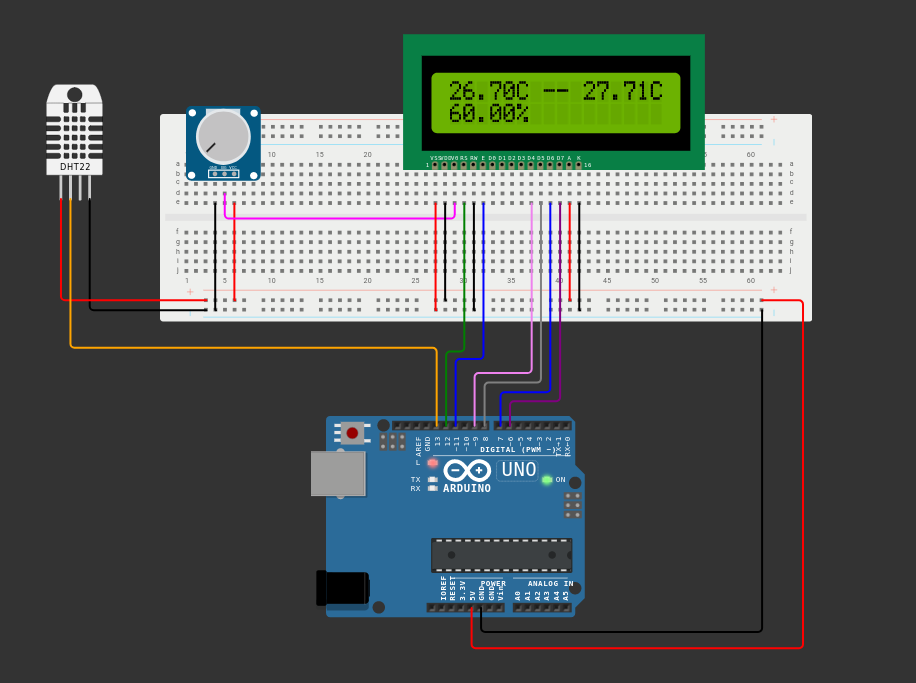

# temperature-sensor
Arduino implementation of a way to monitor ambient temperature and humidity.

[Wokwi](https://wokwi.com/projects/360114684636930049) can be accessed for a simulation.

## Hardware Implementation

### List of Components
| Component        | Quantity    |
| -----------      | ----------- |
| LCD1602          | 1           |
| Potentiometer    | 1           |
| DHT22 (or DHT11) | 1           |
| Breadboard       | 1           |
| Arduino Uno      | 1           | 
